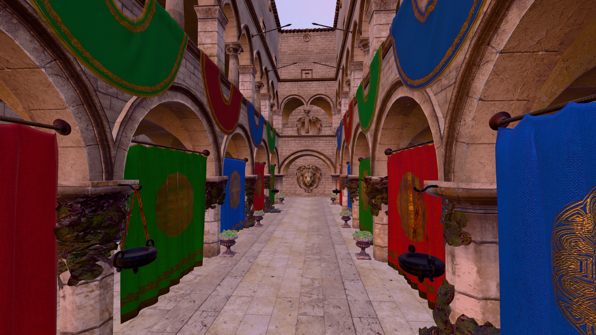
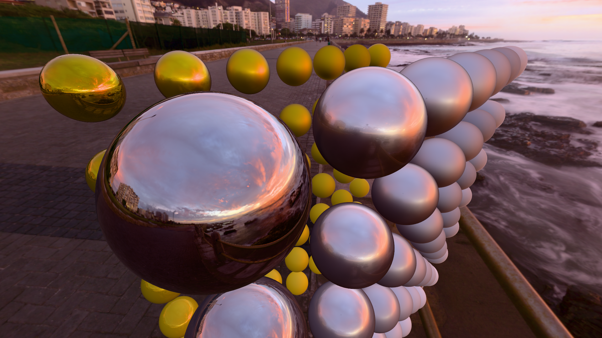

# Real-Time PBR Renderer written with Rust, Vulkan and Slang




## Features
* Image Based Lighting
* Cook-Torrance BRDF
* Forward PBR Shading
* Vulkan Dynamic Rendering
* Bindless Textures
* glTF 2.0 Asset Pipeline
* Normal Mapping
* Tangent Generation
* Slang Shaders
* Tone mapping
* MSAA
* Swapchain Recreation
* Custom RAII implementation
* First Person Camera

## Build & Run

```bash
git clone https://github.com/gavrix32/vulkan-renderer.git
cd hwrt
./src/shaders/compile.sh
cargo build --release
cargo run --release
```

## Sponza Atrium Model

This project uses the Sponza Atrium model by Crytek for demonstration and testing purposes.

The Sponza Atrium model and textures are © Crytek and are used here for non-commercial purposes only.  
Original source: https://www.crytek.com/cryengine/cryengine3/downloads